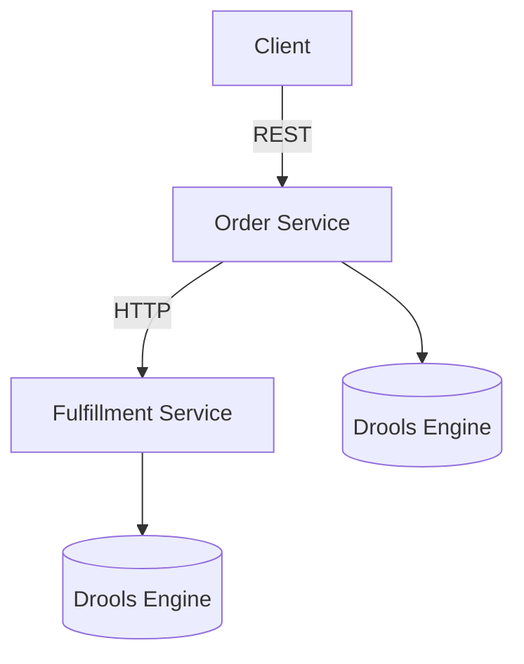
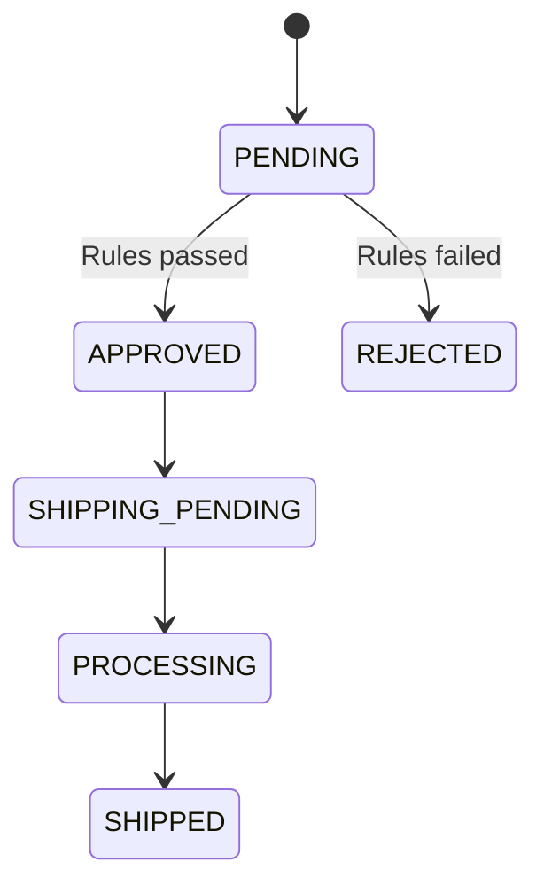
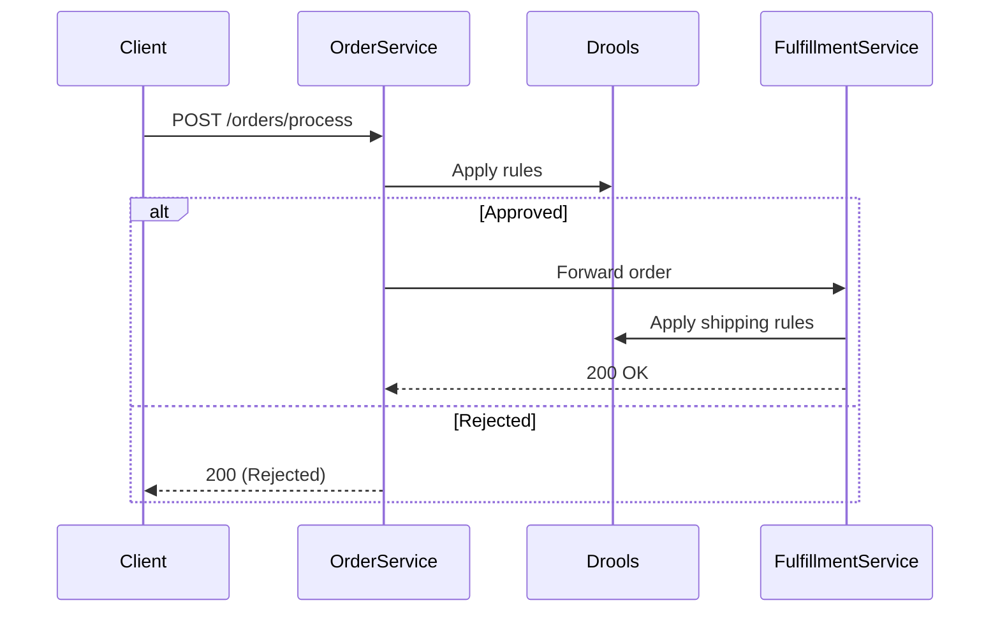

# Camel-Drools-Fulfillment Microservices System


A distributed system demonstrating integration of Apache Camel with Drools across two microservices:
1. **Order Processing Service** - Handles order validation and approval
2. **Fulfillment Service** - Manages shipping and logistics

## Table of Contents
- [System Overview](#system-overview)
- [Architecture Diagrams](#architecture-diagrams)
- [Services](#services)
- [Technology Stack](#technology-stack)
- [Getting Started](#getting-started)
  - [Prerequisites](#prerequisites)
  - [Installation](#installation)
- [API Documentation](#api-documentation)
- [Business Rules](#business-rules)
- [Service Communication](#service-communication)
- [Error Handling](#error-handling)
- [Testing](#testing)
- [Monitoring](#monitoring)
- [Extending the System](#extending-the-system)
- [Troubleshooting](#troubleshooting)
- [License](#license)

## System Overview


The system implements a complete order processing pipeline:

1. **Order Service** (Port 8080):
   - Validates incoming orders
   - Applies business rules using Drools
   - Forwards approved orders to Fulfillment Service

2. **Fulfillment Service** (Port 8081):
   - Determines shipping methods
   - Sets priority levels
   - Updates order fulfillment status

## Architecture Diagrams

### Component Diagram


### Order State Flow


## Services

### 1. Order Processing Service
- **Port**: 8080
- **Responsibilities**:
  - Order validation
  - Approval/rejection logic
  - Discount calculation
  - Forwarding to fulfillment

### 2. Fulfillment Service
- **Port**: 8081
- **Responsibilities**:
  - Shipping method determination
  - Priority assignment
  - Inventory management
  - Delivery scheduling

## Technology Stack

| Component               | Order Service | Fulfillment Service |
|-------------------------|---------------|---------------------|
| Spring Boot             | ✓             | ✓                   |
| Apache Camel            | ✓             | ✓                   |
| Drools                  | ✓             | ✓                   |
| REST API                | ✓             | ✓                   |
| SEDA Queues             | ✓             | ✓                   |
| Scheduled Jobs          | ✓             | ✓                   |

## Getting Started

### Prerequisites
- Java 11+
- Maven 3.6+
- (Optional) Docker for containerization

### Installation
1. Clone the repository:
   ```bash
   git clone https://github.com/your-repo/
   ```

2. Build both services:
   ```bash
   mvn clean install
   cd ../fulfillment-service && mvn clean install
   ```

3. Run the services:
   ```bash
   # In separate terminals
    mvn spring-boot:run
   cd fulfillment-service && mvn spring-boot:run
   ```

## API Documentation

### Order Service Endpoints
| Endpoint | Method | Description |
|----------|--------|-------------|
| `/api/orders/process` | POST | Process new order |
| `/api/orders/health` | GET | Service health check |

### Fulfillment Service Endpoints
| Endpoint | Method | Description |
|----------|--------|-------------|
| `/api/fulfillment/orders` | POST | Process fulfillment |
| `/api/fulfillment/health` | GET | Service health check |

## Business Rules

### Order Service Rules
1. High Value Orders (≥ $1000): Auto-approved
2. Premium Customers: 10% discount
3. Regular Customers (≥ $500): 5% discount
4. Low Value Orders (< $100): Rejected

### Fulfillment Service Rules
1. High Value (≥ $500): Express shipping
2. Premium Customers: Priority handling
3. Regular Orders: Standard shipping
4. Low Value: Economy shipping

## Service Communication



## Error Handling

Common error scenarios:
1. **Validation Errors**: Return HTTP 400
2. **Processing Errors**: Return HTTP 500 with details
3. **Service Unavailable**: Retry mechanism with 3 attempts

## Testing

Run the comprehensive test script:
```bash
.fulfillment-service/NEW.bat  # Windows
.fulfillment-service/NEW.sh   # Linux/Mac
```

Test cases covered:
1. Valid order processing
2. Order rejection
3. Invalid input handling
4. Service health checks

## Monitoring

Available endpoints:
- `http://localhost:8080/actuator/health` (Order Service)
- `http://localhost:8081/actuator/health` (Fulfillment Service)
- `http://localhost:8080/actuator/camelroutes` (Camel routes)

## Extending the System

### Adding New Services
1. Create new Spring Boot module
2. Define Camel routes
3. Add service discovery configuration

### Modifying Rules
Edit the Drools rules in:
- `OrderService`: `DroolsService.java`
- `FulfillmentService`: `FulfillmentRulesService.java`

## Troubleshooting

Common issues and solutions:

| Issue | Solution |
|-------|----------|
| Serialization errors | Verify model classes match in both services |
| HTTP 500 errors | Check Drools rule syntax |
| Connection refused | Verify both services are running |
| Rule not firing | Check rule conditions match data |

## License

Apache License 2.0

```

Key improvements in this version:
1. Clear separation of the two microservices
2. Detailed architecture diagrams
3. Service-specific documentation
4. Comprehensive testing approach
5. Better error handling documentation
6. Practical extension guidance
7. Improved troubleshooting section

The README now accurately reflects the distributed nature of your system and provides clear pathways for development and maintenance.
